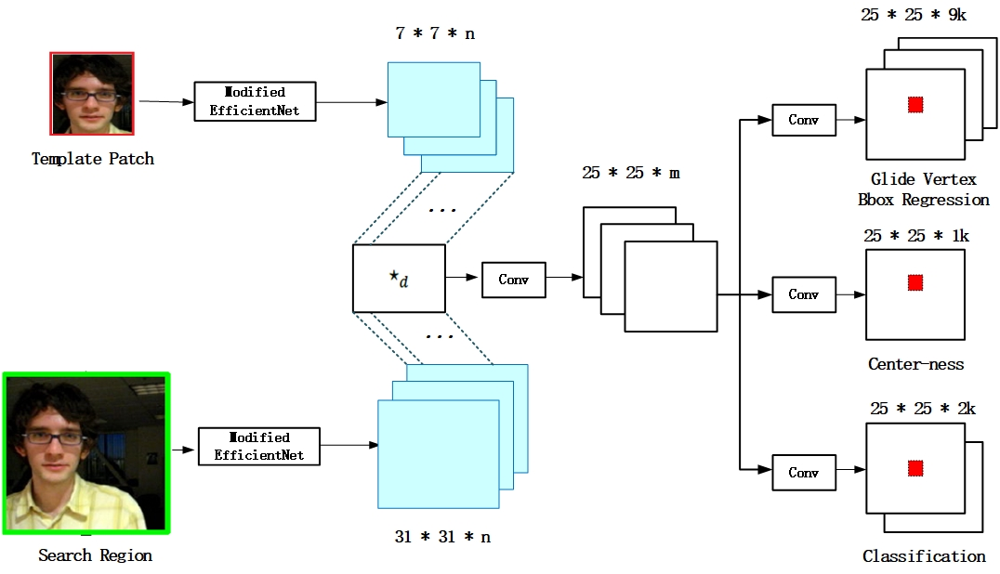
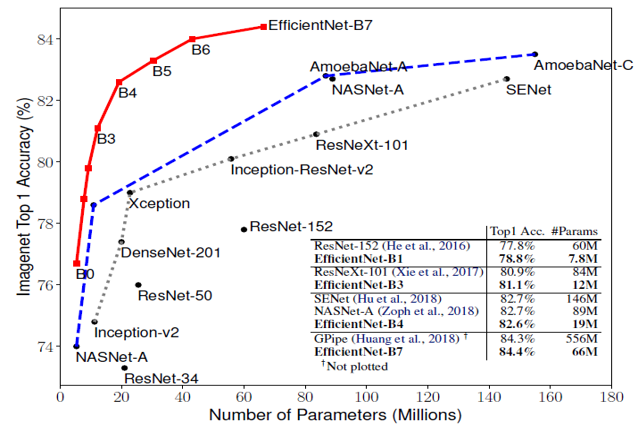
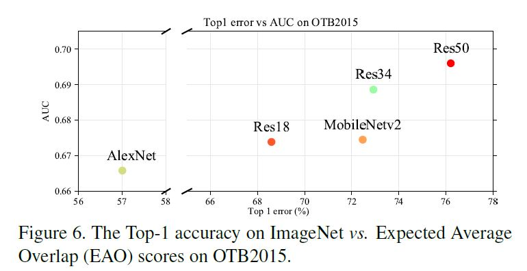

# SiamTrack

## SiamGRPN Neural network architecture
&emsp;&emsp;在SiamRPN的基础上重新设计了网络结构,总共包括五个改进步骤:`backbone
的替换`,`glide vertex Bbox Regression`,`Center-ness Branch`, 
`边框回归损失的选择`.改进后的跟踪器网络命名为SiamGRPN, 网络的整体架构如下图所示:

### EfficientNet的使用

&emsp;&emsp;如下图所示,`Efficientnet`在目标检测领域已经验证了该特征提取器的优越性.

性能远低于EfficientN&emsp;&emsp;目标跟踪领域目前使用最先进的特征提取器是ResNet50,但是在目标检测任务上
et.如下图所示,一般在ImageNet目标检测任务上表现较好的特征提取器,在OTB目标跟踪任务上的性能也优异.因此,可以考虑使用更优异的特征提取器.同时,
也需要考虑模型大小对跟踪速度的影响.如果一个模型过大,即使跟踪的精度再高,也无法达到
实时跟踪的效果.考虑以上两点,EfficientNet是一个backbone替换的最优选择.

&emsp;&emsp;考虑到跟踪器的实时性,只针对EfficientNetB0~B6在DaSiamRPN基础上
展开实验.训练的数据集使用`COCO`,`ImageNet DET`,`ImageNet VID`,`YouTube-BB`
(YouTube-bb数据集暂时不参与训练).初步使用的测试数据集`VOT2018`,`VOT2019`.

### Center-ness Branch(FCOS)

&emsp;&emsp;

### Glide Vertex Bbox Regression

&emsp;&emsp;

### the choice of Bbox Regression Loss
 
&emsp;&emsp;

### Template Feature Enhancement Mechanism 